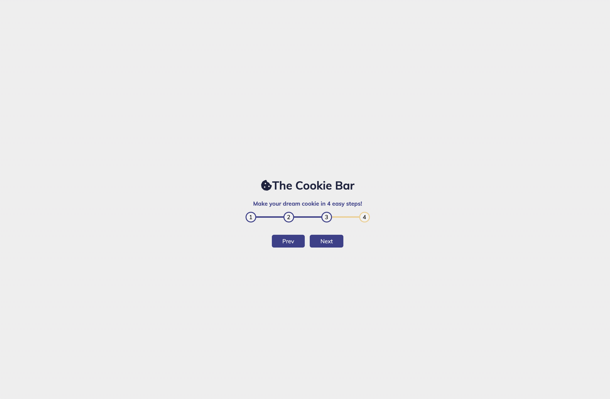

# Progress Steps

This type of component is frequently seen on forms, and shopping carts. Simply put is a progress bar. It has two buttons, previous and next, that allow the user to progress to the next step, or to go back a step.

## Table of contents

- [Screenshot](#screenshot)
- [Links](#links)
- [Built with](#built-with)

### Screenshot

### Links

- [Live Site URL](https://rosalialey.github.io/progress-steps-component/)

### Built with

- Semantic HTML5 markup
- CSS custom properties
- Flexbox
- JavaScript
